  

 

  
  &nbsp;&nbsp;
  
  &nbsp;&nbsp;
  

 

## ⚡ the short version

- 🤖 i build **ai agents that build software** — they plan, code, verify, repair and ship **overnight, unattended**, while i sleep
- 🗣 i'd rather talk than type — so i built [**spuk**](https://github.com/1mp3ctz/spuk) 👻, on-device push-to-talk dictation. no cloud, no subscription, no audio leaves the machine
- 🎓 even my code reviewer gets homework — [**codex-coach**](https://github.com/1mp3ctz/codex-coach) grades its reviews and turns every miss into a lesson it learns
- 🍃 the whole operation runs **local-first on a fanless macbook air** and free tiers: **0€/month**
- 🏔 it student in the austrian alps · de / en / pl

 

## 🧰 daily drivers

  
  
  
  
  
  
  
  
  
  

 

## 📊 the dashboard

  

 

## 🐍 the snake eats my commits

  <picture>
    <source media="(prefers-color-scheme: dark)" srcset="https://raw.githubusercontent.com/1mp3ctz/1mp3ctz/output/github-snake-dark.svg"/>
    
  </picture>

 
