  

 

  
  &nbsp;&nbsp;
  
  &nbsp;&nbsp;
  

 

## ⚡ the short version

- 🤖 i build **ai agents that build software** — they plan, code, verify, repair and ship **overnight, unattended**, while i sleep
- 🗣 i'd rather talk than type — so i built [**spuk**](https://github.com/1mp3ctz/spuk) 👻, on-device push-to-talk dictation. no cloud, no subscription, no audio leaves the machine
- 🎓 even my code reviewer gets homework — [**codex-coach**](https://github.com/1mp3ctz/codex-coach) grades its reviews and turns every miss into a lesson it learns
- 🍃 the whole operation runs **local-first on a fanless macbook air** and free tiers: **0€/month**
- 🏔 it student in the austrian alps · de / en / pl

 

## 🧰 daily drivers

  
  
  
  
  
  
  
  
  
  

 

## 🚀 public builds

  
  &nbsp;
  

 

## 🔬 meanwhile, in the lab…

16 private repos where the weird stuff happens:

| project | what it does |
|---|---|
| **MurxUI** | local-first ai chat workbench — its agents build new features for it overnight |
| **JARVIS** | always-on voice daemon for my mac. tony stark mode: activated |
| **Mylyfe** | ios lifestyle tracker with a living companion you feed by photographing your meals |
| **DevDock** | native macos menu-bar cockpit that tames all my dev servers |
| **Tanky Wars** | 3d tank capture-the-flag in unity — for balance |
| *…and 11 more* | *discord research bots, a psd2 finance dashboard, security tooling, meta-configs* |

 

## 📊 the dashboard

  
    
  

 

## 🐍 the snake eats my commits

  <picture>
    <source media="(prefers-color-scheme: dark)" srcset="https://raw.githubusercontent.com/1mp3ctz/1mp3ctz/output/github-snake-dark.svg"/>
    
  </picture>

 

  

  <b>full disclosure:</b> this page — including its animations — was designed, built and shipped by my own ai agents. i just approved the vibe. ✨

